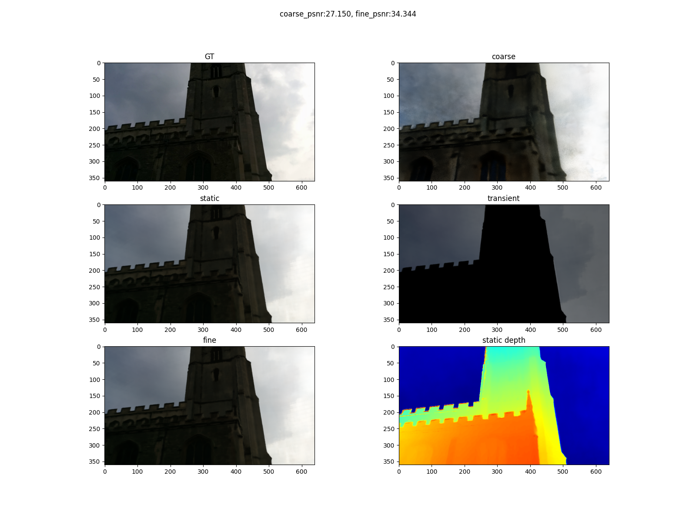

# NeRFW-pytorch

this is a re-implementation of nerf
variant [《NeRF in the Wild: Neural Radiance Fields for Unconstrained Photo Collections》](https://arxiv.org/pdf/2008.02268.pdf).

## Overview(ignore this part)

### NeRF

[Nerf](https://arxiv.org/pdf/2003.08934.pdf) is a novel view rendering method for creating realistic 3D images from a
set of 2D views. A Nerf uses neural networks MLPs to implicitly represent the scene as a continuous 5D function(3D
location and 2D direction), which can capture the complex geometry and appearance of the real scene such as reflections,
shadows and transparency. Nerf takes the 5D coordinates as input and output the color and density of the scene in that
point. By querying many points along a camera ray, a NeRF can render a novel view of the scene using volume rendering.

What you need to train a NeRF:

1. A set of images of the same scene from different viewpoints.
2. Camera parameters for each image.

### NeRF-w

[Nerf-w]((https://arxiv.org/pdf/2008.02268.pdf)) proposed in 2021 is a variant of NeRF that can be trained on
unconstrained image collections. Unlimited real-world images are often taken with tons of variations like lighting,
weather, camera parameters, exposure times, also sometimes it contains dynamic objects like moving vehicles,
pedestrians, which partially or completely occlude the scene, causing artifacts like ghosting and blurring.

NeRF-w assumes that the original NeRF models a totally static scene, then it uses two embeddings respectively appearance
and transient embeddings to handle those variations.

1. Appearance embedding: It describes the individual attributes like illumination and exposure of each unlimited view.
2. Transient embedding: Along with transient embedding, NeRF-w individually models the transient objects using a
   separate MLP θ3 for each image, the same way as the original NeRF models the static scene.

### Visual localization

Visual localization is the task of estimating the camera pose of a query image with respect to a known 3D scene.

After training a NeRF-w model, we can synthesize novel views of the scene from any camera pose(limited by scene density
and train views). So we can use the synthesized views to train a visual localization model.

Referring [《LENS: Localization enhanced by NeRF synthesis》](https://arxiv.org/pdf/2110.06558.pdf)

- more on [visual localization](https://github.com/siyandong/awesome-visual-localization)

## environments

- python 3.8.10
- `./requirements.txt`

support multi gpus training with pytorch DDP strategy, I use 4 RTX3080 to train the model, 1 gpu to test, and 4 gpus to
synthesize novel views.

## training

Tips:

1. The parameters `encode_a` and `encode_t` are for the fine.
2. Default no appearance embedding for the coarse, you can add it by setting coarse model `encode_a` to True to enable
   appearance.
3. You can even add 2 or more fine models in the `NeRFWSystem`, just to add more `CustomNeRFW` when initializing
   the `NeRFWSystem` and modify the forward function of `NeRFWSystem`.
4. `nerfw_system_updated.py` is the latest version of the model, which supports the appearance embedding and transient embedding for the coarse model and supports extension of the multi-fine models. The released model is trained with the old version `nerfw_system.py` structure.

### Cambridge Landmarks

<details>
  <summary>Steps</summary>

#### 1. download dataset

6 scenes: KingsCollege, OldHospital, ShopFacade, StMarysChurch, Street, GreatCourt.
link: [Cambridge Landmarks](https://mi.eng.cam.ac.uk/projects/relocalisation/#dataset)

#### 2. training model

example:

```shell
python train_nerfw_DDP.py \
--root_dir ./runs/nerf --exp_name exp \
--batch_size 1024 --chunk 4*1024 --epochs 20 --lr 0.0005 \
--num_gpus 4 \

--img_downscale 3 \
--data_root_dir $Cambridge_DIR --scene SyMarysChurch \
--use_cache False --if_save_cache True \

--N_c 64 --N_f 128 \
--perturb 1.0 \
--encode_a True --encode_t True --a_dim 48 --t_dim 16 \
--beta_min 0.1 --lambda_u 0.01
```

tips:

- `encode_a` or `encode_t`: whether to use appearance or transient embedding
- when first training, set `use_cache` to False and `if_save_cache` to True, then the program will save the cache file
  to
  speed up the training process next time.
- structure of the dataset:
    ```
    Cambridge
    ├── SyMarysChurch/KingsCollege...
    │   ├── seq1
    │   │   ├── 000000.jpg
    │   │   ├── 000001.jpg
    │   │   ├── ...
    │   ├── seq2...
    │   ├── dataset_train.txt
    │   ├── dataset_test.txt
    │   ├── cache
    │   │   ├── rays cache file...
    ```
- how to resume? set `last_epoch` > 0 and set `ckpt` to the path of the checkpoint file saved every `save_latest_freq`
  steps.
- see `./option/nerf_option.py` for more configurations, tensorboard is supported in the experiment dir.

#### 3. some results

<div style="text-align:center;">
  
</div>


</details>

### 7 scenes

<details>
  <summary>Steps</summary>

#### 1. download dataset

7 scenes: Fire, Heads, Office, Pumpkin, Redkitchen, Stairs, Storage.

link: [7 scenes](https://www.microsoft.com/en-us/research/project/rgb-d-dataset-7-scenes/)

re-localization depth: [7 scenes re-localization depth](https://heidata.uni-heidelberg.de/api/access/datafile/:persistentId?persistentId=doi:10.11588/data/N07HKC/4PLEEJ)

#### 2. training model

example:

```shell
python train_nerfw_DDP.py \
--root_dir ./runs/nerf --exp_name exp \
--batch_size 1024 --chunk 4*1024 --epochs 20 --lr 0.0005 \
--num_gpus 4 \

--img_downscale 2 \
--data_root_dir $7scenes_DIR --scene Fire \
--use_cache False --if_save_cache True \

--N_c 64 --N_f 128 \
--perturb 1.0 \
--encode_a True --encode_t True --a_dim 48
```


#### 3. some results

<div style="text-align:center;">
  
</div>

</details>

## test

I haven't tried any more datasets yet, but I think it's very simple to implement others.

Just to write a dataset class and prepare all the rays, poses, etc. with the same format as the Cambridge or 7 scenes
datasets.

1. `inference.ipynb` file, containing some visualization and evaluation code of the trained NeRFW.
2. `visualize_camera.py` is used to visualize the camera pose of the Cambridge or 7 scenes dataset, output
   a `camera_views.ply` for meshlab.
3. `predict_sigma.py`、`select_novel_views` and `gene_synthesis_dataset` are used to generate the novel views for visual
   localization.

## references

mainly refers to [nerf_pl](https://github.com/kwea123/nerf_pl/tree/nerfw) project, thanks to the author @kwea123.
